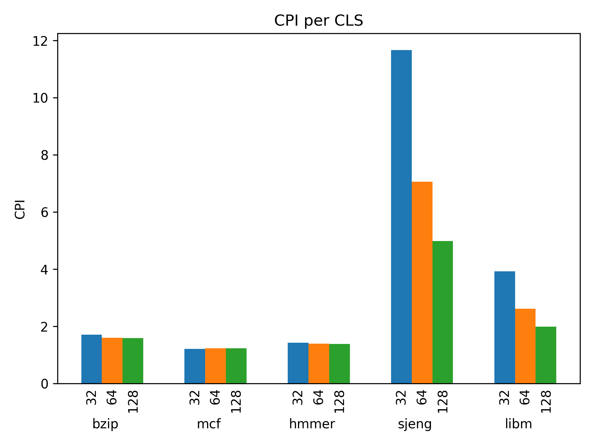
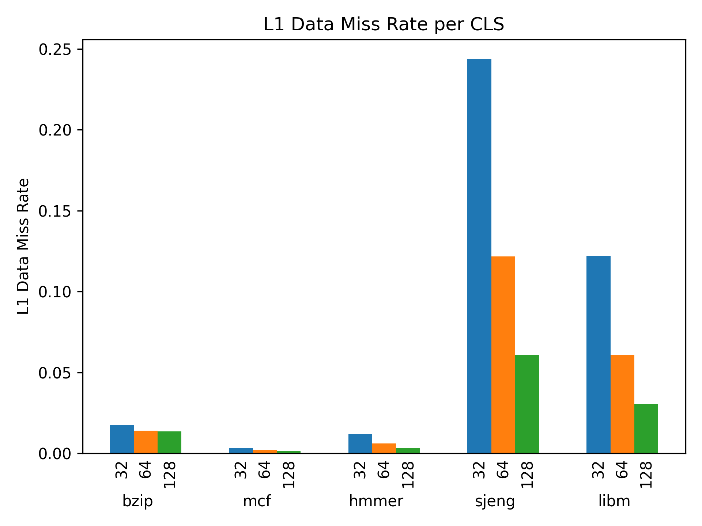
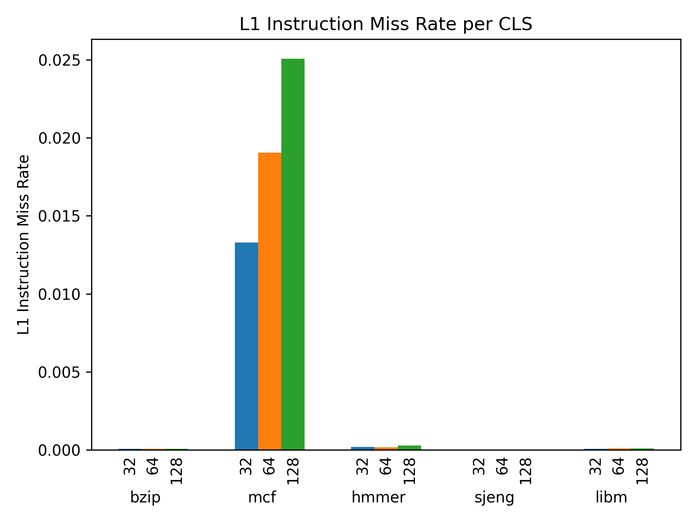
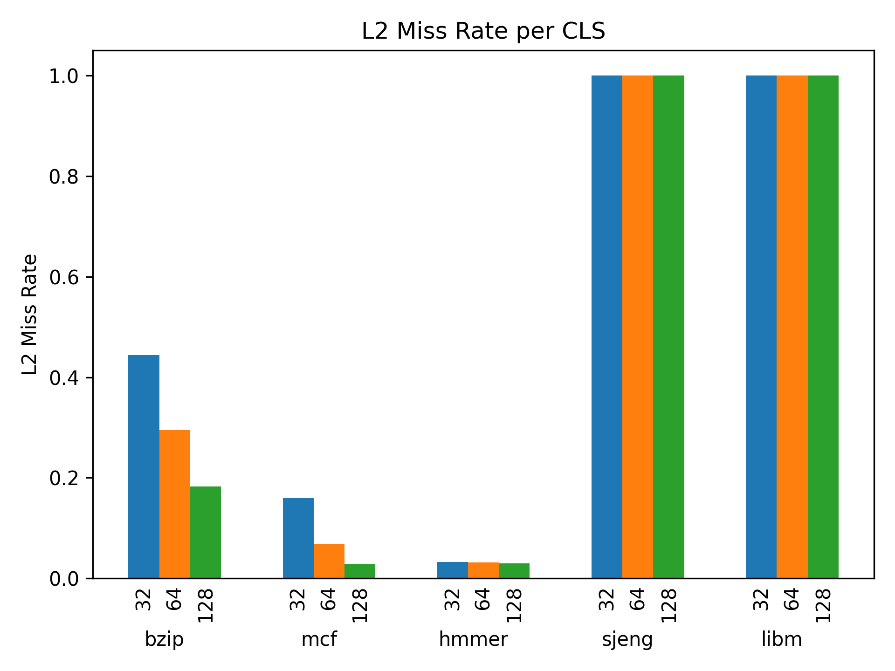
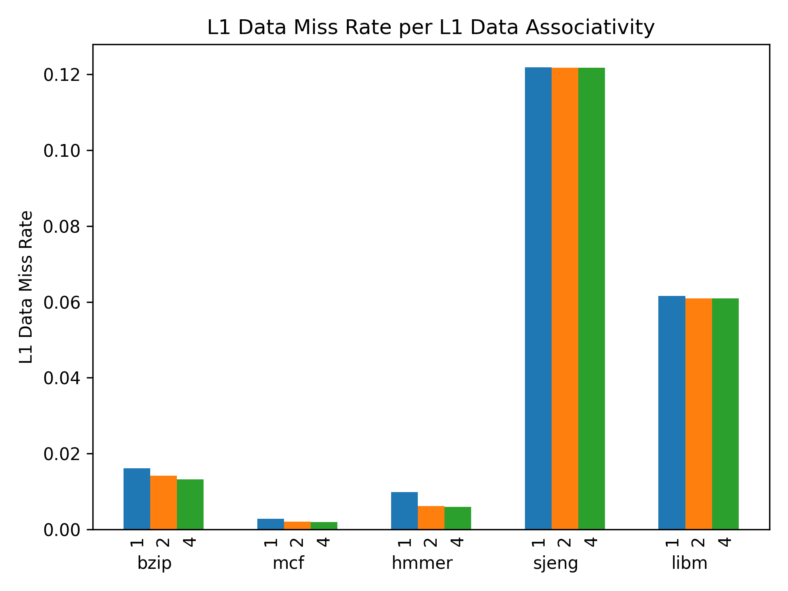
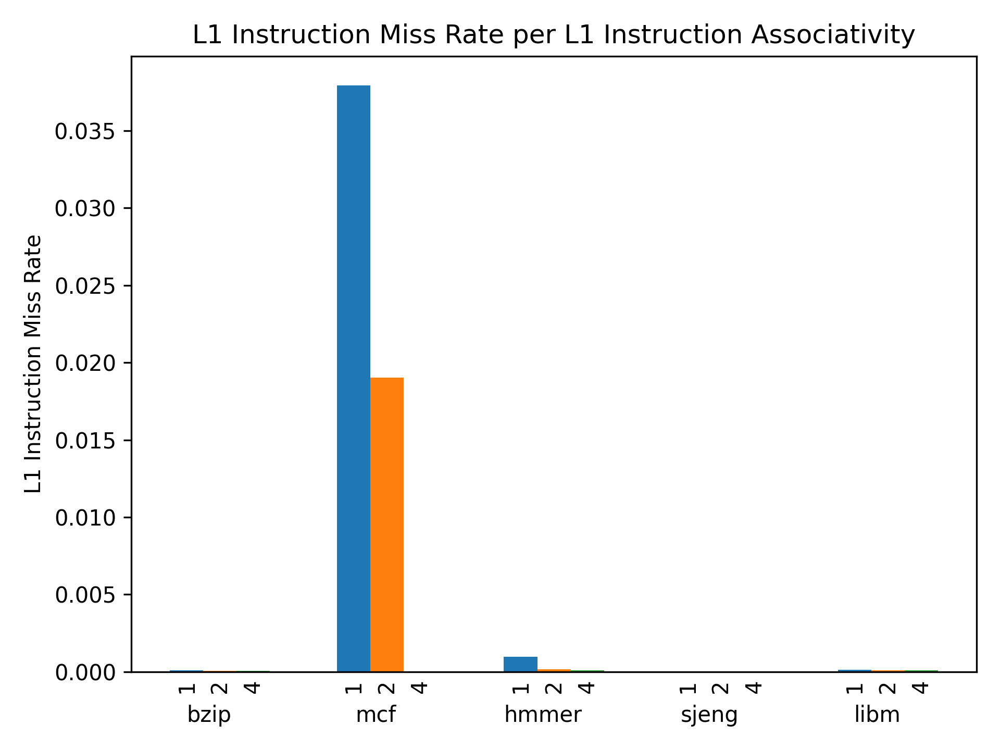
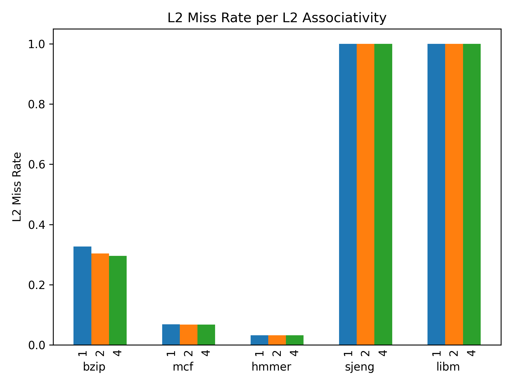
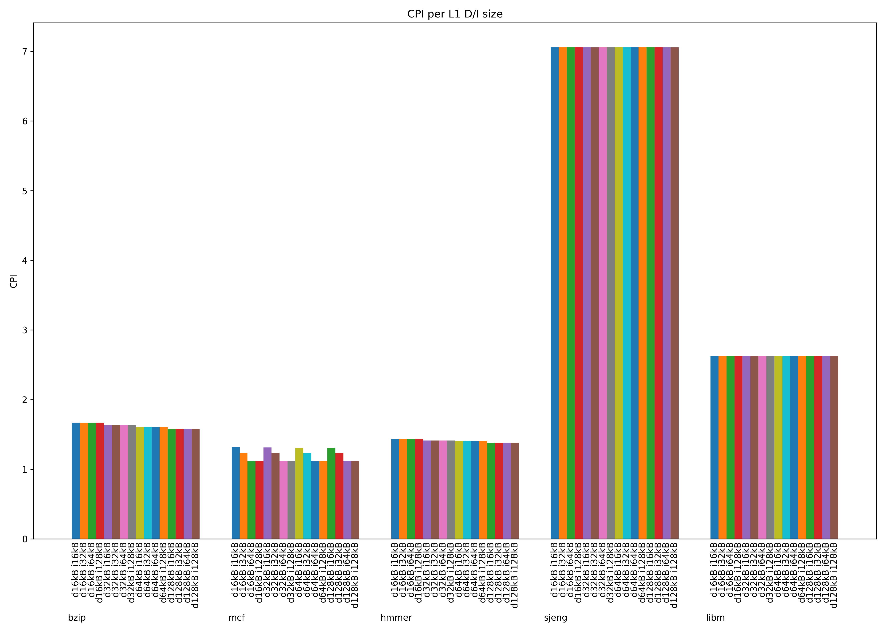
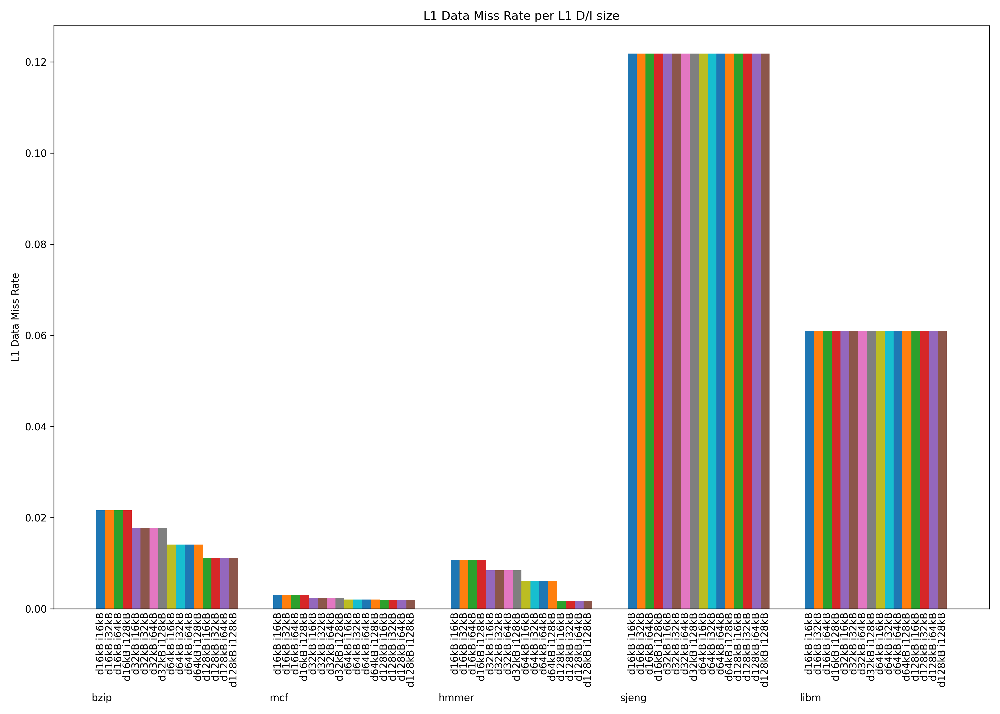
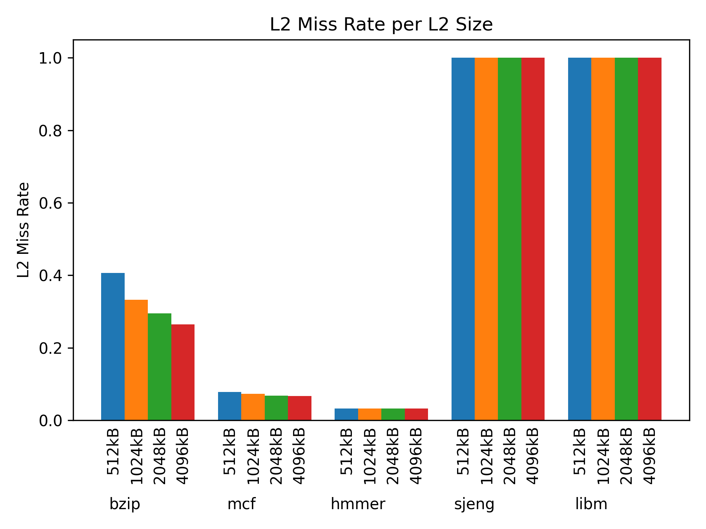

# 2η εργασία Αρχιτεκτονικής Προηγμένων Υπολογιστών
## Συντελεστές (ομάδα 9):
Κυδώνης Ιωάννης, ΑΕΜ: 9407, email: ikydonis@ece.auth.gr  
Ούρδας Αντώνιος, ΑΕΜ: 9358, email: ourdasav@ece.auth.gr

## Βήμα 1

### Ερώτημα 1

Από το αρχείο εξόδου config.ini βλέπουμε ότι το υποσύστημα μνήμης χαρακτηρίζεται από τις εξής παραμέτρους:

- [system.cpu.icache] -> size = 32768 = 32kB
- [system.cpu.dcache] -> size = 65536 = 64kB
- [system.l2] -> size = 2097152 = 2MB
- [system.cpu.icache] -> assoc = 2
- [system.cpu.dcache] -> assoc = 2
- [system.l2] -> assoc = 8
- [system] -> cache_line_size = 64

### Ερώτημα 2

| Benchmark | Χρόνος Εκτέλεσης | CPI | L1 dcache miss rate | L1 icache miss rate | L2 cache miss rate |
| --- | --- | --- | --- | --- | --- |
| specbzip | 0.083656 | 1.673124 | 0.014312 | 0.000075 | 0.295245 |
| spechmmer | 0.070205 | 1.404099 | 0.006198 | 0.000170 | 0.031957 |
| speclibm | 0.174764 | 3.495270 | 0.060972 | 0.000095 | 0.999940 |
| specmcf | 0.062472 | 1.249432 | 0.002113 | 0.019032 | 0.067657 |
| specsjeng | 0.513859 | 10.277188 | 0.121831 | 0.000020 | 0.999978 |

Ακολουθούν γραφήματα με τα παραπάνω δεδομένα:


Από τα παραπάνω γραφήματα παρατηρούμε ότι η συμπεριφορά ενός συστήματος μπορεί να διαφέρει σημαντικά ανάλογα με το benchmark το οποίο εκτελείται. Οπότε το κάθε benchmark από μόνο του δεν αρκεί για να μας δώσει μια συνολική εικόνα για την απόδοση του συστήματος.

Το μέσο CPI το οποίο προκύπτει από την εξομοίωση του κάθε benchmark φαίνεται να έχει ισχυρή συσχέτιση με το miss rate που έχουν αθροιστικά και οι 3 caches.
Επιπλέον, το μέσο CPI βρίσκεται σε αντιστοιχία με τα simulation seconds.

Παρατηρούμε ότι το specmcf benchmark παρουσιάζει πολύ μεγαλύτερο miss rate στην L1 instruction cache από το οποίο μπορούμε να συμπεράνουμε ότι το benchmark αυτό τρέχει κώδικα οι εντολές του οποίου δεν εκτελούνται ακολουθιακά αλλά περιέχουν μεγάλο αριθμό από branches.

Αντίστοιχα τα benchmarks speclibm και specsjeng φαίνεται ότι προσπαθούν να κάνουν access σε δεδομένα τα οποία δεν έχουν συνέχεια στη μνήμη. Αυτό επιβεβαιώνεται τόσο από τις τιμές miss rate στην L1 data cache όσο και στην L2 cache.

### Ερώτημα 3

Ακολουθούν τα αποτελέσματα από την εκτέλεση των benchmark για CPU clock = 1GHz (η default τιμή ήταν ήδη 2GHz).

| Benchmarks | Χρόνος Εκτέλεσης | CPI | L1 dcache miss rate | L1 icache miss rate | L2 cache miss rate |
| --- | --- | --- | --- | --- | --- |
| specbzip_1GH | 0.160352 | 1.603524 | 0.014123 | 0.000075 | 0.295236 |
| spechmmer_1GH | 0.140134 | 1.401338 | 0.006197 | 0.000170 | 0.031957 |
| speclibm_1GH | 0.262262 | 2.622617 | 0.060972 | 0.000095 | 0.999940 |
| specmcf_1GH | 0.123107 | 1.231070 | 0.002113 | 0.019046 | 0.067657 |
| specsjeng_1GH | 0.705639 | 7.056394 | 0.121831 | 0.000020 | 0.999978 |

Από το config.ini αρχείο παρατηρούμε ότι:
- [system.clk_domain] -> clock = 1000
- [system.cpu_clk_domain] -> clock = 500

Το πρώτο φαίνεται πως αποτελεί ρολόι το οποίο συγχρονίζει όλα τα μέρη του συστήματος μεταξύ τους ενώ το δεύτερο αφορά τη συχνότητα της CPU.

Αν προστεθεί ένας ακόμα επεξεργαστής αυτός θα πρέπει να έχει την ίδια συχνότητα με τον πρώτο για λόγους συνοχής και συγχρονισμού των 2 μονάδων επεξεργασίας.

Παρατηρούμε ότι το CPI για τα 3 από τα benchmarks (bzip, hmmer, mcf) σχεδόν διπλασιάστηκε ενώ για τα άλλα 2 (lidm, sjeng) παρουσίασε μικρότερη αύξηση.
Αυτό οφείλεται στο γεγονός ότι τα άλλα 2 benchmarks παρουσιάζουν μεγαλύτερη καθυστέρηση λόγω αυξημένου miss rate στην cache οπότε η συσχέτιση του CPI με τη συχνότητα της CPU είναι ασθενέστερη.
Παρατηρούμε δηλαδή ότι δεν μπορεί να υπάρξει τέλειο scaling καθώς το CPI στην πράξη δεν εξαρτάται μόνο από τον επεξεργαστή αλλά και από την ανάγκη του προγράμματος που εκτελείται για πρόσβαση στη μνήμη, η οποία δεν μπορεί να γίνεται πάντα βέλτιστα.

## Βήμα 2

### Ερώτημα 1

Πραγματοποιήθηκαν δοκιμές σε όλα τα benchmarks τροποποιώντας κάθε φορά μόνο μία παράμετρο για να εξεταστεί η βέλτιστη τιμή της.
Εξαίρεση αποτελεί το ζεύγος παραμέτρων L1 Data Cache Size και L1 Instruction Cache Size για το οποίο πραγματοποιήθηκαν όλοι οι πιθανοί συνδυασμοί δοκιμών.
Ακολουθούν τα αποτελέσματα που προέκυψαν από την εκτέλεση των benchmarks.

Αποτελέσματα των benchmarks για bzip

| Version | sim_seconds | system.cpu.cpi | system.cpu.dcache.overall_miss_rate::total | system.cpu.icache.overall_miss_rate::total | system.l2.overall_miss_rate::total |
| --- | --- | --- | --- | --- | --- |
| cls_128 | 0.159660 | 1.596596 | 0.013685 | 0.000066 | 0.182453 |
| cls_32 | 0.170779 | 1.707788 | 0.017566 | 0.000085 | 0.443757 |
| cls_64 | 0.160359 | 1.603595 | 0.014123 | 0.000075 | 0.295235 |
| l1da_1 | 0.162209 | 1.622089 | 0.016074 | 0.000075 | 0.258075 |
| l1da_2 | 0.160359 | 1.603595 | 0.014123 | 0.000075 | 0.295235 |
| l1da_4 | 0.159520 | 1.595201 | 0.013218 | 0.000075 | 0.317083 |
| l1ds_128kB_l1is_128kB | 0.157622 | 1.576218 | 0.011127 | 0.000066 | 0.382557 |
| l1ds_128kB_l1is_16kB | 0.157635 | 1.576352 | 0.011126 | 0.000080 | 0.382589 |
| l1ds_128kB_l1is_32kB | 0.157628 | 1.576282 | 0.011126 | 0.000075 | 0.382548 |
| l1ds_128kB_l1is_64kB | 0.157625 | 1.576249 | 0.011126 | 0.000068 | 0.382547 |
| l1ds_16kB_l1is_128kB | 0.167113 | 1.671135 | 0.021650 | 0.000066 | 0.187990 |
| l1ds_16kB_l1is_16kB | 0.167115 | 1.671146 | 0.021649 | 0.000080 | 0.188033 |
| l1ds_16kB_l1is_32kB | 0.167122 | 1.671215 | 0.021648 | 0.000075 | 0.188002 |
| l1ds_16kB_l1is_64kB | 0.167117 | 1.671165 | 0.021649 | 0.000068 | 0.187989 |
| l1ds_32kB_l1is_128kB | 0.163782 | 1.637821 | 0.017831 | 0.000066 | 0.230387 |
| l1ds_32kB_l1is_16kB | 0.163797 | 1.637965 | 0.017830 | 0.000080 | 0.230432 |
| l1ds_32kB_l1is_32kB | 0.163790 | 1.637899 | 0.017830 | 0.000075 | 0.230395 |
| l1ds_32kB_l1is_64kB | 0.163778 | 1.637780 | 0.017829 | 0.000068 | 0.230385 |
| l1ds_64kB_l1is_128kB | 0.160344 | 1.603436 | 0.014124 | 0.000066 | 0.295233 |
| l1ds_64kB_l1is_16kB | 0.160362 | 1.603617 | 0.014123 | 0.000080 | 0.295275 |
| l1ds_64kB_l1is_32kB | 0.160359 | 1.603595 | 0.014123 | 0.000075 | 0.295235 |
| l1ds_64kB_l1is_64kB | 0.160347 | 1.603474 | 0.014122 | 0.000068 | 0.295227 |
| l1ia_1 | 0.160367 | 1.603671 | 0.014123 | 0.000086 | 0.295210 |
| l1ia_2 | 0.160359 | 1.603595 | 0.014123 | 0.000075 | 0.295235 |
| l1ia_4 | 0.160349 | 1.603491 | 0.014122 | 0.000066 | 0.295268 |
| l2a_1 | 0.161448 | 1.614480 | 0.014106 | 0.000075 | 0.326772 |
| l2a_2 | 0.160694 | 1.606936 | 0.014116 | 0.000075 | 0.303379 |
| l2a_4 | 0.160293 | 1.602931 | 0.014118 | 0.000075 | 0.295319 |
| l2s_1024kB | 0.162009 | 1.620090 | 0.014124 | 0.000075 | 0.332513 |
| l2s_2048kB | 0.160359 | 1.603595 | 0.014123 | 0.000075 | 0.295235 |
| l2s_4096kB | 0.158898 | 1.588982 | 0.014120 | 0.000075 | 0.264309 |
| l2s_512kB | 0.164773 | 1.647733 | 0.014118 | 0.000075 | 0.406032 |

Αποτελέσματα των benchmarks για mcf

| Version | sim_seconds | system.cpu.cpi | system.cpu.dcache.overall_miss_rate::total | system.cpu.icache.overall_miss_rate::total | system.l2.overall_miss_rate::total |
| --- | --- | --- | --- | --- | --- |
| cls_128 | 0.123605 | 1.236049 | 0.001326 | 0.025064 | 0.028495 |
| cls_32 | 0.121456 | 1.214562 | 0.003181 | 0.013287 | 0.159557 |
| cls_64 | 0.123265 | 1.232645 | 0.002062 | 0.019046 | 0.067668 |
| l1da_1 | 0.123599 | 1.235988 | 0.002770 | 0.019044 | 0.065591 |
| l1da_2 | 0.123265 | 1.232645 | 0.002062 | 0.019046 | 0.067668 |
| l1da_4 | 0.123225 | 1.232254 | 0.001967 | 0.019046 | 0.067926 |
| l1ds_128kB_l1is_128kB | 0.111728 | 1.117279 | 0.001926 | 0.000019 | 0.778720 |
| l1ds_128kB_l1is_16kB | 0.130914 | 1.309135 | 0.001926 | 0.035013 | 0.038942 |
| l1ds_128kB_l1is_32kB | 0.123207 | 1.232073 | 0.001926 | 0.019046 | 0.068056 |
| l1ds_128kB_l1is_64kB | 0.111727 | 1.117274 | 0.001926 | 0.000019 | 0.778679 |
| l1ds_16kB_l1is_128kB | 0.112404 | 1.124041 | 0.003046 | 0.000019 | 0.483714 |
| l1ds_16kB_l1is_16kB | 0.131573 | 1.315729 | 0.003045 | 0.035005 | 0.037792 |
| l1ds_16kB_l1is_32kB | 0.123825 | 1.238252 | 0.003045 | 0.019044 | 0.064615 |
| l1ds_16kB_l1is_64kB | 0.112404 | 1.124041 | 0.003047 | 0.000019 | 0.483691 |
| l1ds_32kB_l1is_128kB | 0.111999 | 1.119988 | 0.002444 | 0.000019 | 0.619612 |
| l1ds_32kB_l1is_16kB | 0.131182 | 1.311822 | 0.002444 | 0.035010 | 0.038448 |
| l1ds_32kB_l1is_32kB | 0.123439 | 1.234393 | 0.002444 | 0.019046 | 0.066564 |
| l1ds_32kB_l1is_64kB | 0.111999 | 1.119988 | 0.002444 | 0.000019 | 0.619589 |
| l1ds_64kB_l1is_128kB | 0.111796 | 1.117961 | 0.002062 | 0.000019 | 0.730527 |
| l1ds_64kB_l1is_16kB | 0.130985 | 1.309853 | 0.002062 | 0.035012 | 0.038814 |
| l1ds_64kB_l1is_32kB | 0.123265 | 1.232645 | 0.002062 | 0.019046 | 0.067668 |
| l1ds_64kB_l1is_64kB | 0.111792 | 1.117925 | 0.002062 | 0.000019 | 0.730492 |
| l1ia_1 | 0.132392 | 1.323923 | 0.002062 | 0.037923 | 0.035863 |
| l1ia_2 | 0.123265 | 1.232645 | 0.002062 | 0.019046 | 0.067668 |
| l1ia_4 | 0.111792 | 1.117925 | 0.002062 | 0.000020 | 0.730175 |
| l2a_1 | 0.123290 | 1.232898 | 0.002062 | 0.019046 | 0.068172 |
| l2a_2 | 0.123268 | 1.232680 | 0.002062 | 0.019046 | 0.067754 |
| l2a_4 | 0.123266 | 1.232655 | 0.002062 | 0.019046 | 0.067703 |
| l2s_1024kB | 0.123538 | 1.235381 | 0.002063 | 0.019046 | 0.072910 |
| l2s_2048kB | 0.123265 | 1.232645 | 0.002062 | 0.019046 | 0.067668 |
| l2s_4096kB | 0.123237 | 1.232368 | 0.002062 | 0.019046 | 0.067158 |
| l2s_512kB | 0.123798 | 1.237981 | 0.002063 | 0.019046 | 0.078406 |

Αποτελέσματα των benchmarks για hmmer

| Version | sim_seconds | system.cpu.cpi | system.cpu.dcache.overall_miss_rate::total | system.cpu.icache.overall_miss_rate::total | system.l2.overall_miss_rate::total |
| --- | --- | --- | --- | --- | --- |
| cls_128 | 0.138963 | 1.389630 | 0.003437 | 0.000274 | 0.029439 |
| cls_32 | 0.142479 | 1.424791 | 0.011778 | 0.000189 | 0.032346 |
| cls_64 | 0.140134 | 1.401339 | 0.006197 | 0.000170 | 0.031973 |
| l1da_1 | 0.144379 | 1.443785 | 0.009827 | 0.000171 | 0.017147 |
| l1da_2 | 0.140134 | 1.401339 | 0.006197 | 0.000170 | 0.031973 |
| l1da_4 | 0.139871 | 1.398710 | 0.005914 | 0.000171 | 0.034099 |
| l1ds_128kB_l1is_128kB | 0.138121 | 1.381210 | 0.001770 | 0.000079 | 0.104130 |
| l1ds_128kB_l1is_16kB | 0.138175 | 1.381755 | 0.001770 | 0.000367 | 0.096162 |
| l1ds_128kB_l1is_32kB | 0.138138 | 1.381384 | 0.001770 | 0.000170 | 0.101455 |
| l1ds_128kB_l1is_64kB | 0.138126 | 1.381259 | 0.001770 | 0.000119 | 0.102921 |
| l1ds_16kB_l1is_128kB | 0.143289 | 1.432894 | 0.010726 | 0.000079 | 0.016935 |
| l1ds_16kB_l1is_16kB | 0.143328 | 1.433281 | 0.010726 | 0.000369 | 0.016696 |
| l1ds_16kB_l1is_32kB | 0.143306 | 1.433058 | 0.010726 | 0.000172 | 0.016854 |
| l1ds_16kB_l1is_64kB | 0.143291 | 1.432910 | 0.010726 | 0.000121 | 0.016897 |
| l1ds_32kB_l1is_128kB | 0.141188 | 1.411883 | 0.008463 | 0.000079 | 0.023676 |
| l1ds_32kB_l1is_16kB | 0.141227 | 1.412269 | 0.008463 | 0.000369 | 0.023220 |
| l1ds_32kB_l1is_32kB | 0.141199 | 1.411992 | 0.008463 | 0.000171 | 0.023524 |
| l1ds_32kB_l1is_64kB | 0.141190 | 1.411896 | 0.008463 | 0.000121 | 0.023605 |
| l1ds_64kB_l1is_128kB | 0.140121 | 1.401212 | 0.006197 | 0.000079 | 0.032246 |
| l1ds_64kB_l1is_16kB | 0.140168 | 1.401684 | 0.006197 | 0.000368 | 0.031418 |
| l1ds_64kB_l1is_32kB | 0.140134 | 1.401339 | 0.006197 | 0.000170 | 0.031973 |
| l1ds_64kB_l1is_64kB | 0.140124 | 1.401239 | 0.006197 | 0.000119 | 0.032121 |
| l1ia_1 | 0.140314 | 1.403138 | 0.006197 | 0.000972 | 0.029888 |
| l1ia_2 | 0.140134 | 1.401339 | 0.006197 | 0.000170 | 0.031973 |
| l1ia_4 | 0.140123 | 1.401234 | 0.006197 | 0.000092 | 0.032193 |
| l2a_1 | 0.140134 | 1.401339 | 0.006197 | 0.000170 | 0.031973 |
| l2a_2 | 0.140134 | 1.401339 | 0.006197 | 0.000170 | 0.031973 |
| l2a_4 | 0.140134 | 1.401339 | 0.006197 | 0.000170 | 0.031973 |
| l2s_1024kB | 0.140134 | 1.401339 | 0.006197 | 0.000170 | 0.031973 |
| l2s_2048kB | 0.140134 | 1.401339 | 0.006197 | 0.000170 | 0.031973 |
| l2s_4096kB | 0.140134 | 1.401339 | 0.006197 | 0.000170 | 0.031973 |
| l2s_512kB | 0.140134 | 1.401339 | 0.006197 | 0.000170 | 0.031973 |

Αποτελέσματα των benchmarks για sjeng

| Version | sim_seconds | system.cpu.cpi | system.cpu.dcache.overall_miss_rate::total | system.cpu.icache.overall_miss_rate::total | system.l2.overall_miss_rate::total |
| --- | --- | --- | --- | --- | --- |
| cls_128 | 0.498482 | 4.984822 | 0.060918 | 0.000014 | 0.999951 |
| cls_32 | 1.166566 | 11.665655 | 0.243656 | 0.000022 | 0.999989 |
| cls_64 | 0.705640 | 7.056395 | 0.121831 | 0.000020 | 0.999978 |
| l1da_1 | 0.705481 | 7.054807 | 0.121858 | 0.000020 | 0.999542 |
| l1da_2 | 0.705640 | 7.056395 | 0.121831 | 0.000020 | 0.999978 |
| l1da_4 | 0.705640 | 7.056395 | 0.121831 | 0.000020 | 0.999979 |
| l1ds_128kB_l1is_128kB | 0.705450 | 7.054505 | 0.121831 | 0.000019 | 0.999987 |
| l1ds_128kB_l1is_16kB | 0.705456 | 7.054561 | 0.121830 | 0.000022 | 0.999968 |
| l1ds_128kB_l1is_32kB | 0.705449 | 7.054495 | 0.121830 | 0.000020 | 0.999981 |
| l1ds_128kB_l1is_64kB | 0.705452 | 7.054522 | 0.121831 | 0.000019 | 0.999986 |
| l1ds_16kB_l1is_128kB | 0.705453 | 7.054532 | 0.121836 | 0.000019 | 0.999906 |
| l1ds_16kB_l1is_16kB | 0.705647 | 7.056473 | 0.121836 | 0.000022 | 0.999887 |
| l1ds_16kB_l1is_32kB | 0.705463 | 7.054629 | 0.121836 | 0.000020 | 0.999900 |
| l1ds_16kB_l1is_64kB | 0.705459 | 7.054590 | 0.121836 | 0.000019 | 0.999905 |
| l1ds_32kB_l1is_128kB | 0.705450 | 7.054502 | 0.121832 | 0.000019 | 0.999973 |
| l1ds_32kB_l1is_16kB | 0.705455 | 7.054550 | 0.121832 | 0.000022 | 0.999954 |
| l1ds_32kB_l1is_32kB | 0.705640 | 7.056395 | 0.121832 | 0.000020 | 0.999967 |
| l1ds_32kB_l1is_64kB | 0.705450 | 7.054502 | 0.121832 | 0.000019 | 0.999972 |
| l1ds_64kB_l1is_128kB | 0.705447 | 7.054471 | 0.121831 | 0.000019 | 0.999985 |
| l1ds_64kB_l1is_16kB | 0.705640 | 7.056395 | 0.121831 | 0.000022 | 0.999966 |
| l1ds_64kB_l1is_32kB | 0.705640 | 7.056395 | 0.121831 | 0.000020 | 0.999978 |
| l1ds_64kB_l1is_64kB | 0.705447 | 7.054466 | 0.121831 | 0.000019 | 0.999983 |
| l1ia_1 | 0.705454 | 7.054544 | 0.121831 | 0.000021 | 0.999972 |
| l1ia_2 | 0.705640 | 7.056395 | 0.121831 | 0.000020 | 0.999978 |
| l1ia_4 | 0.705450 | 7.054502 | 0.121831 | 0.000019 | 0.999982 |
| l2a_1 | 0.705403 | 7.054032 | 0.121831 | 0.000020 | 0.999978 |
| l2a_2 | 0.705419 | 7.054192 | 0.121831 | 0.000020 | 0.999978 |
| l2a_4 | 0.705426 | 7.054262 | 0.121831 | 0.000020 | 0.999978 |
| l2s_1024kB | 0.705530 | 7.055298 | 0.121831 | 0.000020 | 0.999978 |
| l2s_2048kB | 0.705640 | 7.056395 | 0.121831 | 0.000020 | 0.999978 |
| l2s_4096kB | 0.705285 | 7.052854 | 0.121831 | 0.000020 | 0.999978 |
| l2s_512kB | 0.705519 | 7.055191 | 0.121831 | 0.000020 | 0.999978 |

Αποτελέσματα των benchmarks για libm

| Version | sim_seconds | system.cpu.cpi | system.cpu.dcache.overall_miss_rate::total | system.cpu.icache.overall_miss_rate::total | system.l2.overall_miss_rate::total |
| --- | --- | --- | --- | --- | --- |
| cls_128 | 0.198998 | 1.989979 | 0.030487 | 0.000106 | 0.999819 |
| cls_32 | 0.392066 | 3.920660 | 0.121940 | 0.000085 | 0.999980 |
| cls_64 | 0.262262 | 2.622616 | 0.060972 | 0.000095 | 0.999940 |
| l1da_1 | 0.263855 | 2.638548 | 0.061561 | 0.000095 | 0.986461 |
| l1da_2 | 0.262262 | 2.622616 | 0.060972 | 0.000095 | 0.999940 |
| l1da_4 | 0.262262 | 2.622616 | 0.060972 | 0.000095 | 0.999940 |
| l1ds_128kB_l1is_128kB | 0.262250 | 2.622504 | 0.060972 | 0.000085 | 0.999983 |
| l1ds_128kB_l1is_16kB | 0.262252 | 2.622520 | 0.060972 | 0.000113 | 0.999866 |
| l1ds_128kB_l1is_32kB | 0.262262 | 2.622616 | 0.060972 | 0.000095 | 0.999940 |
| l1ds_128kB_l1is_64kB | 0.262250 | 2.622504 | 0.060972 | 0.000087 | 0.999976 |
| l1ds_16kB_l1is_128kB | 0.262250 | 2.622504 | 0.060972 | 0.000085 | 0.999976 |
| l1ds_16kB_l1is_16kB | 0.262252 | 2.622520 | 0.060972 | 0.000113 | 0.999860 |
| l1ds_16kB_l1is_32kB | 0.262254 | 2.622539 | 0.060972 | 0.000095 | 0.999933 |
| l1ds_16kB_l1is_64kB | 0.262250 | 2.622504 | 0.060972 | 0.000087 | 0.999969 |
| l1ds_32kB_l1is_128kB | 0.262250 | 2.622504 | 0.060972 | 0.000085 | 0.999983 |
| l1ds_32kB_l1is_16kB | 0.262252 | 2.622520 | 0.060972 | 0.000113 | 0.999866 |
| l1ds_32kB_l1is_32kB | 0.262262 | 2.622616 | 0.060972 | 0.000095 | 0.999940 |
| l1ds_32kB_l1is_64kB | 0.262250 | 2.622504 | 0.060972 | 0.000087 | 0.999976 |
| l1ds_64kB_l1is_128kB | 0.262250 | 2.622504 | 0.060972 | 0.000085 | 0.999983 |
| l1ds_64kB_l1is_16kB | 0.262252 | 2.622520 | 0.060972 | 0.000113 | 0.999866 |
| l1ds_64kB_l1is_32kB | 0.262262 | 2.622616 | 0.060972 | 0.000095 | 0.999940 |
| l1ds_64kB_l1is_64kB | 0.262250 | 2.622504 | 0.060972 | 0.000087 | 0.999976 |
| l1ia_1 | 0.262254 | 2.622539 | 0.060972 | 0.000125 | 0.999819 |
| l1ia_2 | 0.262262 | 2.622616 | 0.060972 | 0.000095 | 0.999940 |
| l1ia_4 | 0.262258 | 2.622578 | 0.060972 | 0.000089 | 0.999968 |
| l2a_1 | 0.262262 | 2.622616 | 0.060972 | 0.000095 | 0.999940 |
| l2a_2 | 0.262262 | 2.622616 | 0.060972 | 0.000095 | 0.999940 |
| l2a_4 | 0.262262 | 2.622616 | 0.060972 | 0.000095 | 0.999940 |
| l2s_1024kB | 0.262371 | 2.623706 | 0.060972 | 0.000095 | 0.999940 |
| l2s_2048kB | 0.262262 | 2.622616 | 0.060972 | 0.000095 | 0.999940 |
| l2s_4096kB | 0.262020 | 2.620203 | 0.060972 | 0.000095 | 0.999940 |
| l2s_512kB | 0.262433 | 2.624329 | 0.060972 | 0.000095 | 0.999940 |

### Ερώτημα 2






















Παρατηρούμε ότι το cacheline size παίζει σημαντικό ρόλο στη μείωση του miss rate για την L1 data και L2 cache αλλά όχι για την L1 instruction cache.
Βλέπουμε επίσης ότι το associativity έχει μεγαλύτερη επιρροή στο miss rate της L1 instruction cache.
Το μέγεθος της cache φαίνεται να μειώνει τα miss rates σε όλα τα επίπεδα caches για τα benchmarks bzip, mcf, hmmer.
Τα υπόλοιπα benchmarks δε φαίνεται να επηρεάζονται ιδιαίτερα και αυτό λογικό αν δεν αξιοποιούν το locality της μνήμης.

## Βήμα 3

Η συνάρτηση υπολογισμού απόδοσης χρειάζεται να λαμβάνει υπόψιν της τον μέσο χρόνο πρόσβασης στη μνήμη καθώς θέλουμε να πετύχουμε μία συνολικά καλή απόδοση και όχι μία βελτιστοποίηση για έναν συγκεκριμένο σκοπό.
Η δεύτερη παράμετρος που συμπεριλάβαμε στη συνάρτηση υπολογισμού απόδοσης είναι το μέσο CPI κανονικοποιημένο ως προς τη συχνότητα του επεξεργαστή αλλά και τον αριθμό των πυρήνων.

```
Performance = 1 / (Average Memory Access Time) + (CPU Frequency) * (CPU Cores) / CPI
```

Από το βιβλίο _Hennessy, Patterson - Computer Architecture and Design edition 5_ έχουμε ότι:
```
Average Memory Access Time = Hit time + Miss rate * Average miss penalty

ή αναδρομικά για τα 2 επίπεδα caches

Average Memory Access Time = Hit time(L1) + Miss rate (L1) * Average miss penalty(L1)

όπου

Average miss penalty(L1) = Hit time(L2) + Miss rate(L2) * Average miss penalty(L2)
```

Θεωρούμε ως Hit time(L1) = 1, Hit time(L2) = 10 και Average miss penalty(L2) = 100.

Για τον υπολογισμό του κόστους θεωρούμε το ίδιο κόστος για L1 instruction και data cache.
Για κάθε στοιχείο ορίζεται ένας συντελεστής ο οποίος εμπειρικά έχει διαφορά μίας τάξης μεγέθους από το επίπεδο L1 στο επίπεδο L2.
Κανονικοποιώντας ως προς το μέγιστο μέγεθος της κάθε παραμέτρου προκύπτει:

```
Cost = (CLS)/128 * 10 + (L1DS + L1IS)/128 * 10 + (L1DA + L1IA)/4 * 10 + (L2S)/4096 * 1 + (L2A)/4 * 1
```

Για τον υπολογισμό του _Performance/Cost_ για όλους τους συνδυασμούς καταχωρήθηκαν όλα τα δεδομένα μαζί με τις συναρτήσεις απόδοσης και κόστους σε ένα excel sheet.
Στη συνέχεια έγιναν highlight οι μέγιστες τιμές _Performance/Cost_ για κάθε πείραμα και κάθε benchmark ώστε να φανεί ποια είναι η βέλτιστη σχεδίαση για το κάθε benchmark με βάση τις συναρτήσεις που ορίστηκαν παραπάνω.

Κατόπιν μελέτης των διαγραμμάτων που προέκυψαν αποφασίσαμε να σχεδιάσουμε το σύστημά μας με βάση τα πορίσματα που προέκυψαν από τα benchmarks bzip και hmmer αποκλείοντας από τον υπολογισμό τα mcf, sjeng και libm.
Η επιλογή αυτή έγινε γιατί τα 3 τελευταία παρουσιάζουν έντονα στοχευμένη συμπεριφορά (το πρώτο πετυχαίνει πολύ υψηλό L1 icache miss rate ενώ τα άλλα δύο πολύ υψηλό L1 dcache miss rate), οπότε θεωρήσαμε ότι τα bzip και hmmer μπορούν να δώσουν μια πιο αντιπροσωπευτική εικόνα εκτέλεσης ενός πραγματικού προγράμματος.

Από τα δύο αυτά benchmarks προκύπτουν οι εξής βέλτιστες επιλογές:

| Παράμετρος | bzip | hmmer | Τελική επιλογή |
| --- | --- | --- | --- |
| Cacheline Size | 128 | 128 | 128 |
| L1 Data Associativity | 1 | 2 | 2 |
| L1 Instruction Associativity | 1 | 2 | 2 |
| L2 Associativity | 2 | 1 | 2 |
| L1 Data Size | 32kB | 128kB | 64kB |
| L1 Instruction Size | 16kB | 32kB | 32kB |
| L2 Size | 4096kB | 512kB | 2048kB |

Η τελική επιλογή στις περιπτώσεις που υπήρχε ασυμφωνία μεταξύ των βέλτιστων τιμών που προέκυψαν από τα δύο benchmarks που λήφθηκαν υπόψιν έγινε με τη λήψη της ενδιάμεσης τιμής που προσφέρει το υψηλότερο _Performance/Cost_ συνολικά και για τα 2.

## Κριτική της εργασίας

Στο πλαίσιο της εργασίας αυτής:

- Μάθαμε να ερμηνεύουμε και να αξιολογούμε τα αποτελέσματα των benchmarks
- Μάθαμε να αξιοποιούμε τα benchmarks ώστε να βελτιώνουμε τη σχεδίαση του συστήματός μας
- Προβληματιστήκαμε για τις βέλτιστες επιλογές που μπορούν να γίνουν κατά τη σχεδίαση ενός συστήματος
- Πειραματιστήκαμε με τις βασικές παραμέτρους που επηρεάζουν την απόδοση ενός συστήματος και την επίδραση που έχουν στα αποτελέσματα διαφορετικών benchmark

Ιδιαίτερο ενδιαφέρον παρουσίασαν τα βήματα 2 και 3.
Το βήμα 2 γιατί μελετήθηκε εκτενώς η ανομοιόμορφη επίδραση που μπορεί να έχει η τροποποίηση μιας παραμέτρου του συστήματος στα διάφορα benchmarks.
Το βήμα 3 γιατί χρειάστηκε στάθμιση αντικρουόμενων, σε πολλές περιπτώσεις, συμπερασμάτων και απόρριψη μερικών ώστε να ληφθεί μια σχεδιαστική απόφαση η οποία θα βελτιστοποιεί τη γενική περίπτωση και όχι τις ειδικές περιπτώσεις που μελετώνται.
